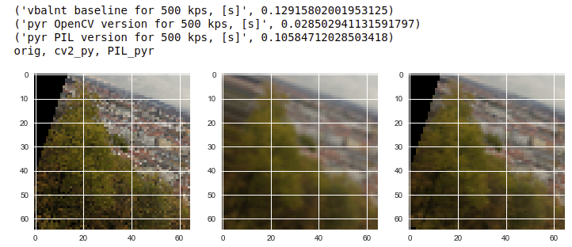

# extract-patches

Simple function for local patch extraction from local features keypoints.
Accepts following formats:

- OpenCV keypoints
- Ellipse format [x y a b c]
- Affine features format [x y a11 a12 a21 a22]
- OpenCV keypoints + A (a11 a12 a21, a22), say from AffNet output


Usage:
    
```python
from extract_patches import extract_patches
PATCH_SIZE = 32
mrSize = 3.0
patches = extract_patches(kps1, img1, PATCH_SIZE, mrSize, 'cv2')
```



See another example in this [notebook](patch-extraction-demo.ipynb)

Thanks to [Vassileios](https://github.com/vbalnt) for the baseline implementation.
